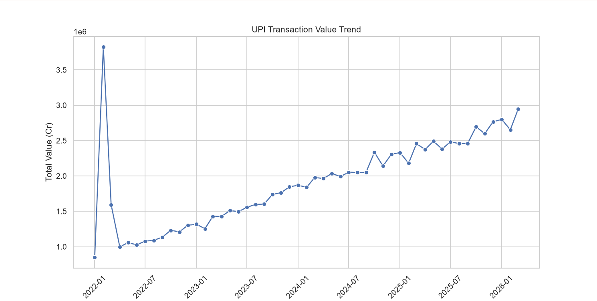
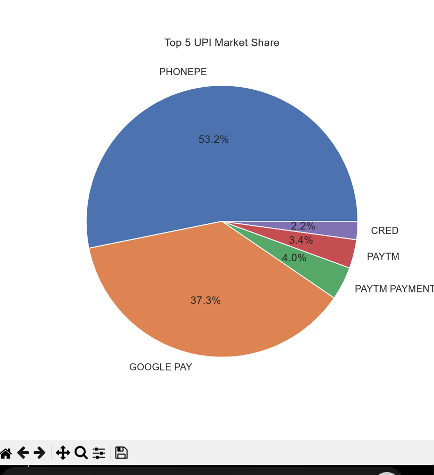
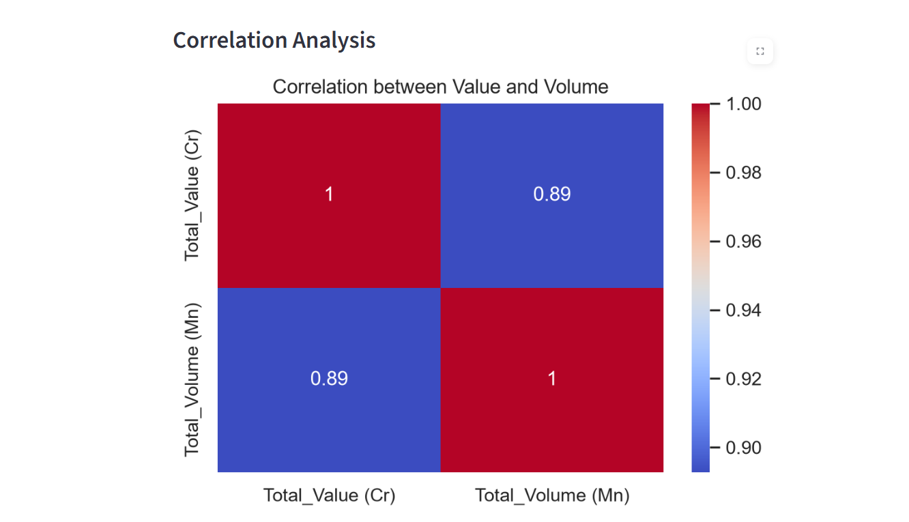
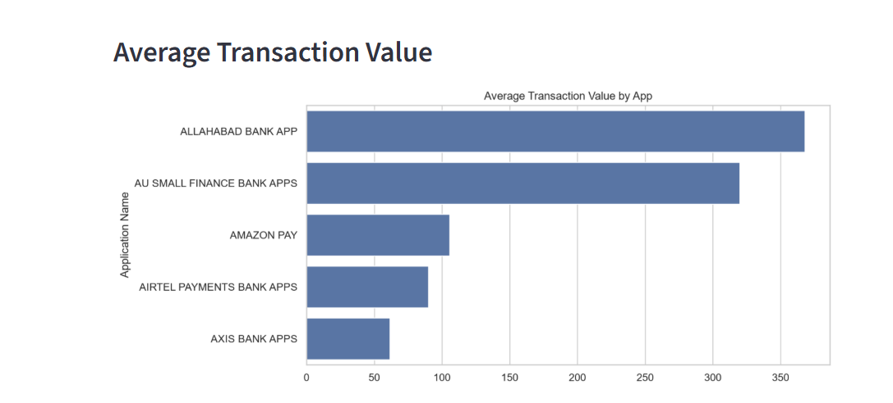
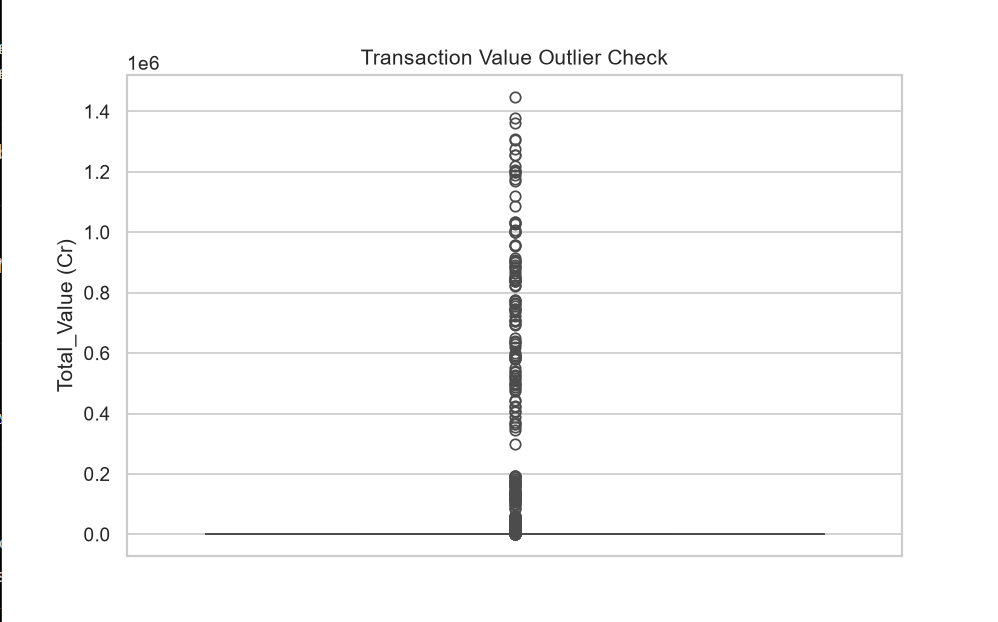

# 📊 UPI Transactions Analysis Dashboard


## 🚀 Live Project
🔗 **Try it here:** [UPI Dashboard Live](https://upi-dashboard-rdjd9vobadrv3smdzn2ofi.streamlit.app/)

## 🧾 1. Project Overview

**Dataset Source:** Kaggle  
**Rows:** 3793  
**Columns:** 12  

### 🎯 Objective
To analyze UPI transaction patterns across applications, understand growth trends, market share, and user behavior using Python and build an interactive Streamlit dashboard.

---

## 📁 2. Dataset Description

| Column | Description | Type |
|--------|-------------|------|
| Application Name | UPI app / bank app name | Object |
| Date | Transaction date | Date |
| Customer Initiated Transactions_Volume (Mn) | Customer initiated transaction count | Float |
| Customer Initiated Transactions_Value (Cr) | Customer transaction value | Float |
| B2C Transactions_Volume (Mn) | Business-to-customer volume | Float |
| B2C Transactions_Value (Cr) | B2C transaction value | Float |
| B2B Transactions_Volume (Mn) | Business-to-business volume | Float |
| B2B Transactions_Value (Cr) | B2B transaction value | Float |
| On-us Transactions_Volume (Mn) | Internal network transaction volume | Float |
| On-us Transactions_Value (Cr) | Internal network transaction value | Float |
| Total_Volume (Mn) | Total transaction volume | Float |
| Total_Value (Cr) | Total transaction value | Float |

---

## 🧹 3. Data Cleaning

### ✔ Duplicate Check
- No duplicate rows found

### ✔ Missing Values
- On-us Transactions_Volume: 159 missing values  
- On-us Transactions_Value: 222 missing values  

### ✔ Handling Strategy
- Missing values filled using **median imputation**
- Reason: transaction data contains outliers, median is more robust
- Nulls were NOT assumed to be zero because dataset already contains explicit 0 values

---

## 📊 4. Feature Engineering

- Extracted **Year** from Date
- Extracted **Month** from Date
- Created **Average Transaction Value**

---

## 📉 5. Key Business Questions

1. Which UPI apps have highest transaction volume?
2. Which apps are growing fastest from 2022–2026?
3. What is monthly UPI transaction trend?
4. What is market share of top apps?
5. Relationship between volume and value?
6. How does each app grow over time?
7. Which apps have highest average transaction value?

---

## 🔄 6. Project Workflow

Raw Data
↓
Data Cleaning (Pandas)
↓
Feature Engineering
↓
EDA (GroupBy / Aggregation)
↓
Visualization (Matplotlib / Seaborn)
↓
Streamlit Dashboard
↓
Insights Extraction


---

## 🛠️ 7. Tech Stack


---

## 📊 8. Dashboard Preview
### 📈 UPI Transaction Trend


Shows overall growth of UPI transactions over time.

---

### 🏆 Market Share Analysis


Displays dominance of top UPI applications.

---

### 📊 App-wise Growth Heatmap


Highlights growth/decline patterns across apps and years.

---

### 💰 Average Transaction Value


Shows spending behavior differences across apps.

---

### 🚨 Outlier Detection


Identifies abnormal transaction spikes.
---

## ▶️ 9. How to Run Locally

```bash
git clone https://github.com/Nandani567/upi-dashboard
cd UPIAnalyst

pip install -r requirements.txt
streamlit run app.py
python main.py 

upi-dashboard/
│
├── UPI.xlsx
── clean_upi_data.csv
│
├── images/
│   ├── trend.png
│   ├── marketShare.png
│   ├── heatmap.png
│   ├── avgTransaction.png
│   └── outlier.png
│
├── app.py
├── requirements.txt
└── README.md